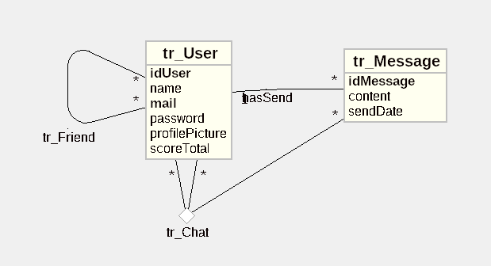

# ft_transcendence

*This project has been created as part of the 42 curriculum by ldesboui, pchazalm, malebrun, edi-maio*

## Description

ft_transcendence is a real-time online chat platform built around user accounts, live messaging, and a reflex-based minigame: a button appears at random intervals, and the fastest player to click it scores a point. The project combines a social/chat experience with a competitive, real-time twist, all served through a containerized, production-style infrastructure (Docker, HTTPS reverse proxy).

The goal of the project is to design and build a complete, modern full-stack web application as a team: from database design and backend API/WebSocket services to a responsive frontend, while following good security practices (HTTPS, hashed passwords/secrets, input validation, protection against common web vulnerabilities) and standard project-management practices for a multi-person team.

**Key features:**
- User registration, authentication (JWT), and profile management
- Live chat between users
- Friends list
- Reflex minigame and score tracking
- Reverse-proxied HTTPS access via Nginx, fully containerized with Docker

## Team Information

| Login | Role(s) | Responsibilities |
|---|---|---|
| ldesboui | Tech Lead, Developer | Backend |
| pchazalm | PO, Developer | Frontend |
| edi-maio | PM, Developer | Backend, Docker |
| malebrun | Developer | Docker |

## Project Management

- **Task distribution:** Docker, Backend (API and Websocket), Frontend
- **Meetings:** Discord calls + team working at school
- **Project management tools:** Github
- **Communication channels:** Discord

## Technical Stack

### Frontend
- Next.js (React)

### Backend
- Node.js (express)
- WebSocket server (`ws`) for real-time game state, chat, and presence
- JWT (`jsonwebtoken`) for authentication
- REST API for standard CRUD operations (`/api/`)

### Database
- MariaDB, accessed via the `mariadb` Node.js driver with a connection pool
- **Why MariaDB:** it's a SGBD we already worked with and know how to use

### Infrastructure
- Docker & Docker Compose (frontend, backend, database, and reverse proxy each in their own container)
- Nginx as a reverse proxy and TLS termination point (HTTPS, WebSocket upgrade support)

### Other notable libraries/tools
- bcrypt for password hashing

**Justification for major technical choices:**
- why Next.js over plain React: We chose Next.js over plain react to manage injections (SQL notably).
- why Nginx as the entry point

## Database Schema

Main tables and relationships:

| Table | Key fields | Description |
|---|---|---|
| `tr_User` | `idUser` (PK), `name`, `mail`, `password`, `profilePicture`, `scoreTotal` | Registered users and their profile/game stats |
| `tr_Message` | `idMessage` (PK), `content`, `sendDate`, `idUser` (FK → `tr_User`) | Chat messages content and author |
| `tr_Chat` | `idUser` (FK), `idUser_1` (FK), `idMessage` (FK) | Links a message to sender and receiver (conversation) |
| `tr_Friend` | `idUser` (FK), `idUser_1` (FK) | Register a friend link between two users |

## Features List

| Feature | Description | Implemented by |
|---|---|---|
| User authentication (JWT) | Users can authenticate with a mail and a password | ldesboui, pchazalm, edi-maio |
| Live chat | Authenticated users can talk with their friends | ldesboui, pchazalm, edi-maio |
| Friends | Authenticated users can add friends using their name | ldesboui, pchazalm, edi-maio |
| Reflex Minigame | A minigame in the chat where the first to click gain 1 point | malebrun |
| Minigame ranking | Users can see how many points every user have | malebrun |

## Modules

In this subject, points are counted as **Major = 2 pts** and **Minor = 1 pt**.

| Module | Type | Points | Implemented by | Justification / notes |
|---|---|---|---|---|
| Use a frontend framework | Minor | 1 | pchazalm | Next.js |
| Use a backend framework | Minor | 1 | ldesboui, edi-maio | Express |
| Implement real-time features using WebSockets or similar technology | Major | 2 | ldesboui | Chat and minigame |
| Allow users to interact with other users | Major | 2 | ldesboui, edi-maio, malebrun | Chat and minigame |
| Custom made design | Minor | 1 | pchazalm | React components |
| Support for additional browsers | Minor | 1 | pchazalm, ldesboui, edi-maio, malebrun | Done by default |
| Standard user management and auth | Major | 2 | ldesboui, edi-maio | Register and login page for users |
| Implement a complete web-based game where users can play against each other | Major | 2 | malebrun | Reflex minigame |
| Remote players — Enable two players on separate computers to play the same game in real-time | Major | 2 | pchazalm, ldesboui, edi-maio, malebrun | Reflex minigame |
| Multiplayer game (more than two players) | Major | 2 | pchazalm, ldesboui, edi-maio, malebrun | Reflex minigame |
| Module of choice 1 | Minor | 1 | ldesboui, edi-maio | Usage of jwt tokens to manage authentication |
| **Total** | | 17 | | |

## Browser compatibility

This module (Minor) extends the application's compatibility to additional browsers.

### Supported browsers

| Browser     | Tested version                  | Status    |
|-------------|----------------------------------|-----------|
| Firefox     | 130+                               | Supported |
| Zen Browser | latest version (Firefox-based)     | Supported |

### Features tested on each browser

- [ ] Authentication / login (JWT, sessions)
- [ ] WebSocket (real-time chat, notifications)
- [ ] Real-time gameplay (Canvas/WebGL rendering, keyboard input)
- [ ] SPA navigation (Next.js routing)
- [ ] Responsive design / UI display
- [ ] Avatar upload and display
- [ ] Dark mode (`prefers-color-scheme`)

### Known browser-specific limitations

> To be completed as testing progresses

- **Firefox**: some CSS animations or transitions may render slightly differently depending on the front-end stack used.
- **Zen Browser**: since it is built on the Firefox engine (Gecko), behavior is largely identical to Firefox; any differences mainly come from the browser's own interface (sidebar, workspaces) rather than actual web rendering.

### UI/UX consistency

Styling is handled with Tailwind CSS v4, compiled to standard CSS at build time via PostCSS. CSS custom properties (`@theme inline`) are used for design tokens (colors, fonts) and `prefers-color-scheme` for automatic dark mode support — both are natively supported by the Gecko engine used in Firefox and Zen. This ensures:
- Identical visual rendering (layout, fonts, colors)
- Identical behavior of interactive components (buttons, forms, modals)
- A smooth and consistent experience across Firefox and Zen, including dark mode

### Testing method

Tests were performed manually on Firefox and Zen Browser, covering all core application features (authentication, chat, gameplay, navigation, and dark mode).

## Individual Contributions

### ldesboui
- **Contributions:** Websockets
- **Challenges faced:** mystical errors, such as cross origin and fixing typos while having to restart docker everytime

### pchazalm
- **Contributions:** frontend
- **Challenges faced:** React

### malebrun
- **Contributions:** minigame, testing
- **Challenges faced:** ldesboui's typos

### edi-maio
- **Contributions:** API, docker
- **Challenges faced:** nginx config

## Resources

- [Next.js Documentation](https://nextjs.org/docs)
- [Node.js `ws` library documentation](https://github.com/websockets/ws)
- [JWT introduction (jwt.io)](https://jwt.io/introduction)
- [MariaDB Documentation](https://mariadb.com/kb/en/documentation/)
- [Nginx reverse proxy documentation](https://nginx.org/en/docs/http/ngx_http_proxy_module.html)
- [Docker Compose documentation](https://docs.docker.com/compose/)

### AI Usage

AI assistance (Claude) was used during this project for:
- debugging docker and API errors
- explain hard notions from documentations
- giving example on function/functionality uses

No AI-generated code was used.
